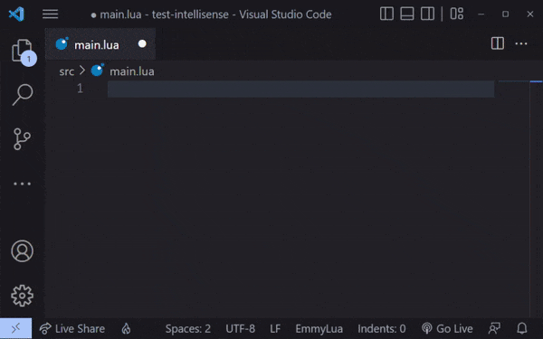

# Lua CLI for Dual Universe

This is a very simple compiler for Dual Universe scripts that will not only combine your Lua source files and generate proper autoconfig files, but also includes improved event handling out of the box.

Currently, the compiler also has some notion of package management, though not very advanced, by allowing you to directly add Git repositories as external libraries, with all downloading and linking being handled by the compiler itself.

The compiler works by scanning and parsing `require` statements. It follows the following naming format: `Package:File`, though you should also be able to directly access a file in your current project by just pointing to the file instead. The `.lua` extension is not required. In cases where you try using `require` with an not found file, you will receive a small warning on your console but it won't fail the build, thus allowing to allow the game's built-in libraries, such as `dkjson`.

To start using the CLI, please refer to our [Getting Started](https://github.com/wolfe-labs/DU-LuaC/wiki/Getting-Started) guide!

## Features

Here's some extra goodies that you have by using the Lua CLI on your next project:

### Code Completion ("IntelliSense") support



For those who use the EmmyLua extension, available for [IntelliJ](https://github.com/EmmyLua/IntelliJ-EmmyLua) and [VS Code](https://github.com/EmmyLua/VSCode-EmmyLua), Lua code completion support can be added by the CLI (including to existing projects) via the following command: `du-lua add-code-completion`

It will add the required files to your project directory, including a portable Lua "Codex" outlining the Lua API for most, if not all components. This Codex is generated based on the official [Lua API Mockup](https://github.com/dual-universe/lua-examples/tree/main/api-mockup) offered by NovaQuark.

You can manually add type-hinting to things such as linked elements in your code by adding `---@type ElementClassName` after its declaration, replacing `ElementClassName` with the desired element class:
```lua
local myCoreUnit = myCoreUnit ---@type CoreUnit
```

### Improved Event Handlers

DU-LuaC has built-in support for multiple event handlers, which makes it easier to write modular scripts as you never override another script's event handler. They are automatically added to any liked component which has in-game events.

In case you want to add event support for your own objects and instances, use the `library.addEventHandlers(yourInstance)` function, which will add three new functions to your object:

| Signature | Description |
| --- | --- |
| `handlerId = obj:onEvent(event, handler, ref)` | Calls `handler` whenever `obj` emits an event of type `event`, optionally replacing the value of `self` with `ref` and optionally saving the handler ID in `handlerId` |
| `obj:clearEvent(event, handlerId)` | Clears the handle with identifier `handlerId` from the event of type `event` on `obj` |
| `obj:triggerEvent(event, arg1, arg2, ...)` | Triggers the event of type `event` on `obj`, passing all following arguments (such as `arg1` and `arg2`) |

Please note that the first argument when calling `handler` **will always be the either the instance itself or the value defined in `ref`**, so for example, the `mouseDown` event for a Screen Unit is triggered as `screen:triggerEvent('mouseDown', x, y)`, but the event handler will have the following signature: `onScreenMouseDown(screen, x, y)`, the same also works for internals such as timers with `onTick(unit, timer)`, etc. If you want to pass down your own `self` to be used inside `handler`, you must pass it as the `ref` argument to `:onEvent`

### Automatic Linking Detection

Allows you to get lists of elements linked on your Control Unit, optionally filtering them by element class and name!

Below you have a list of functions and how to use them:

| Signature | Description | Sample |
| --- | --- | --- |
| `library.getCoreUnit()` | Returns the connection to the Core Unit, if it's connected | `local core = library.getCoreUnit()` |
| `library.getLinks(filter, noLinkNames)` | Gets a list of linked elements, optionally filtering based on the element's function stated in `filter` (you can supply `nil` to ignore filtering). When `noLinkNames` is `true`, you get indexes instead of link names as the keys | `local screens = library.getLinks({ getClass: 'ScreenUnit' })` |
| `library.getLinksByClass(elementClass, noLinkNames)` | Gets a list of linked elements matching the selected class. When `noLinkNames` is `true`, you get indexes instead of link names as the keys | `local screens = library.getLinksByClass('ScreenUnit')` |
| `library.getLinkByClass(elementClass)` | Same as the previous function, but returns the first matching element | `local screen = library.getLinkByClass('ScreenUnit')` |
| `library.getLinkByName(elementName)` | Gets an element's link based on the element name (not the link name!) | `local screen = library.getLinkByName('Main Screen')` |

**Please note that:** to be able to get elements by their name, you will need to link your Core Unit to your Control Unit, thus losing one link. In case you don't want to go that route, you can still hard link your slot via the CLI. The disavantage of this is that you will have to remember the linking order for these elements.

### Embedding Files

With the `library.embedFile(file)` function you are able to embed files at compilation time.

A great use case for HTML templates or any other kind of "large" content. You can simply put everything into a file (let's call it "hud.html"), edit it with your favorite editor's full capability of syntax highlighting and, when done, simply embed it into your code automatically with `local hud = library.embedFile('hud.html')`. All the contents of your file will be output into as a string into the `hud` variable, as if it was always there!

**Please note that:**

- Values passed to that kind of function MUST be literals, so you can't pass any kind of value which requires processing (like `'test' .. 123`, it must be pre-set as `'test123'` instead).

- File paths are relative to the Lua file being currently processed

- File access is restricted only to the current project, due to security concerns

## Post-Mercury (0.30) Support

As of the Mercury (0.30) update, all events now start with the prefix `on`. So, for example, the old `update` event is now `onUpdate`.

To keep transitions like this as easy as possible, the CLI has been versioned, with the Project Format v2 being introduced.

Projects created with the new format should always use `:onEvent('onEventName')`, with the `on` prefix, while projects created previous to that may still use the old format (`:onEvent('eventName')`) and the CLI should automatically translate any calls.

Please keep in mind that events that changed name (such as Laser Detectors now using `onHit`) will need to have their names renamed on code too. You don't need to prefix it with `on` though, just use `:onEvent('hit')` and it will be fine.

### Upgrading to Project Format v2

To upgrade your project to v2, make sure you have fixed all your event handlers to the new format, then add the following JSON to the top of your `project.json` file, right before `"name"`:

```
  "cli": {
    "fmtVersion": 2
  },
```

It should look like this:

```
{
  "cli": {
    "fmtVersion": 2
  },
  "name": "your-project-name",
```

After doing so the CLI **will not** do any translations anymore and you should be using NQ's event format.

## Special Thanks

Code completion is made possible by the Codex generated by [DU-OpenData](https://github.com/wolfe-labs/DU-OpenData), and is powered by NQ's excellent [Lua API Mockup](https://github.com/dual-universe/lua-examples/tree/main/api-mockup).

Special thanks to everyone who contributed on ideas for new features, testing and finding new bugs! You're all amazing!

## About, Contact, Support, etc.

If you have any questions, feel free to ping me in [Wolfe Labs' Discord server](https://discord.gg/YerENgKDre) or at the [DU Open Source Initiative server](https://discord.gg/gu4XX34EGz) and I'll be glad to help!

I don't usually respond to friend requests, sometimes don't even notice them, so if you need to contact me **please** use the Discord server. Ping me, it won't hurt :)

### Donations

In-game donations are more than welcome! Feel free to send any amounts to the **Wolfe Labs** in-game organization.

You can also buy me an IRL coffee too via both [PayPal](https://www.paypal.com/donate?hosted_button_id=YYVSTZ8EN3JSC) and [Pix](https://nubank.com.br/pagar/4rs96/YNDgXVKPoV)